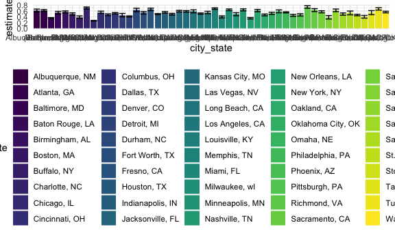
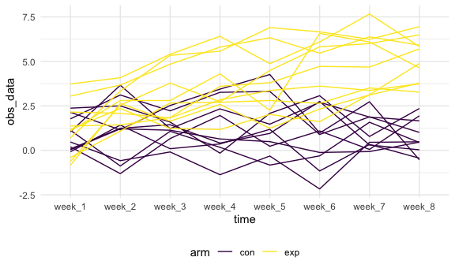
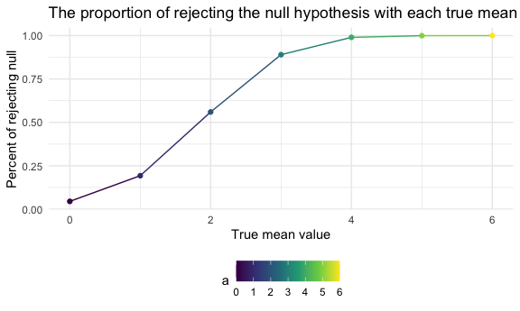
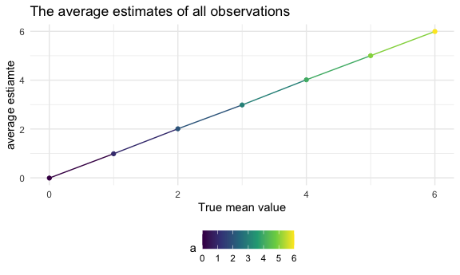
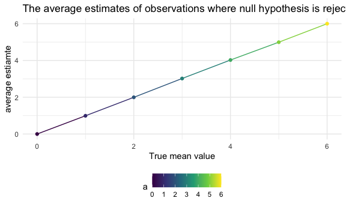

p8105_hw5_tj2519
================
2023-11-08

# Problem 0: load library and some initial setup

``` r
library(tidyverse)
```

    ## ── Attaching core tidyverse packages ──────────────────────── tidyverse 2.0.0 ──
    ## ✔ dplyr     1.1.3     ✔ readr     2.1.4
    ## ✔ forcats   1.0.0     ✔ stringr   1.5.0
    ## ✔ ggplot2   3.4.3     ✔ tibble    3.2.1
    ## ✔ lubridate 1.9.2     ✔ tidyr     1.3.0
    ## ✔ purrr     1.0.2     
    ## ── Conflicts ────────────────────────────────────────── tidyverse_conflicts() ──
    ## ✖ dplyr::filter() masks stats::filter()
    ## ✖ dplyr::lag()    masks stats::lag()
    ## ℹ Use the conflicted package (<http://conflicted.r-lib.org/>) to force all conflicts to become errors

``` r
knitr::opts_chunk$set(
  fig.width = 6,
  fig.asp = .6,
  out.width = "90%"
)

theme_set(theme_minimal() + theme(legend.position = "bottom"))

options(
  ggplot2.continuous.colour = "viridis",
  ggplot2.continuous.fill = "viridis"
)

scale_colour_discrete = scale_colour_viridis_d
scale_fill_discrete = scale_fill_viridis_d
```

# Problem 1

## create the new variable

``` r
pro1_df = 
  read_csv("data_p1/homicide-data.csv") %>% 
  mutate(city_state = paste(city, state, sep = ", ")) %>% 
  mutate(city_state = str_replace(city_state,"Tulsa, AL", "Tulsa, OK"))
```

    ## Rows: 52179 Columns: 12
    ## ── Column specification ────────────────────────────────────────────────────────
    ## Delimiter: ","
    ## chr (9): uid, victim_last, victim_first, victim_race, victim_age, victim_sex...
    ## dbl (3): reported_date, lat, lon
    ## 
    ## ℹ Use `spec()` to retrieve the full column specification for this data.
    ## ℹ Specify the column types or set `show_col_types = FALSE` to quiet this message.

## summarize dataset & Baltimore

``` r
clean_df = pro1_df %>% 
  mutate(disposition = 
           ifelse(disposition %in% c("Closed without arrest", "Open/No arrest"), "Unsolved homicides", "Solved homicides")) %>%
  group_by(city_state, disposition) %>% 
  summarize(obs = n()) %>% 
  pivot_wider(names_from = "disposition", values_from = "obs") %>% 
  janitor::clean_names() %>% 
  mutate(total = sum(solved_homicides, unsolved_homicides))
```

    ## `summarise()` has grouped output by 'city_state'. You can override using the
    ## `.groups` argument.

``` r
bal = clean_df %>% 
  filter(city_state == "Baltimore, MD")
  
results = 
  prop.test(pull(bal, solved_homicides), pull(bal, total), conf.level = 0.95) %>% 
  broom::tidy() %>% 
  janitor::clean_names() %>% 
  select(estimate, conf_low, conf_high)
```

\##for each city, calculate the prop

``` r
prop = function(df) {
  
  results = 
  prop.test(pull(df, solved_homicides), pull(df, total), conf.level = 0.95) %>% 
  broom::tidy() %>% 
  janitor::clean_names() %>% 
  select(estimate, conf_low, conf_high)
  
  results
}


clean_df_nest =
  nest(clean_df, data = solved_homicides:total) %>% 
  mutate(results = map(data, prop)) %>% 
  unnest(data) %>% 
  unnest(results) %>% 
  select(-solved_homicides)
```

## plot

``` r
clean_df_nest %>% 
  mutate(city_state = forcats::fct_reorder(city_state, estimate)) %>% 
  ggplot(aes(x = city_state, y = estimate, fill = city_state)) +
  geom_bar(stat = "identity") +
  geom_errorbar(aes(ymin = conf_low, ymax = conf_high))
```



# Problem 2

## readin the names of all csv files, store the names in a dataframe

``` r
pro2_df = 
  tibble(file = list.files(path = "data")) 
```

## Write a function to read the data in each csv filecreate another dataframe to store the data in each csv file, and put the data into the existed dataframe

``` r
read_data = function(df) {
  df_path = paste("data", as.character(df), sep = "/")
 
  read_csv(df_path) %>% 
  janitor::clean_names()

}

data_only = 
  map(pull(pro2_df, file), read_data) %>% 
  bind_rows()
    
pro2_df = 
  pro2_df %>% 
  mutate(data = data_only)
```

\##Tidy the dataframe, f manipulate file names to include the specific
arm and subject ID. Also, as we are dealing with longitudinal data, we
apply pivot_longer

``` r
pro2_df_tidy = 
  pro2_df %>% 
  mutate(file = str_replace(file, "\\..*", "")) %>% 
  mutate(arm_id = file) %>% 
  separate(file, c("arm", "study_id"), sep = "_") %>% 
  unnest(data) %>% 
  pivot_longer(week_1:week_8,
               names_to = "time",
               values_to = "obs_data") 
```

\##Plotting a spaghetti plot

``` r
pro2_df_tidy %>% 
  group_by(arm, study_id) %>% 
  ggplot(aes(x = time, y = obs_data, group = arm_id, color = arm)) +
  geom_line()
```



By looking at the plot, we could observe that in the experimental group,
the overall trend for each individual is increasing from week1 to week8.
In the control group, the participants does not seem to have a clear
trend regarding the reported data from week1 to week8. The experimental
group participants have higher reported data than the control group
counterparts.

# Problem3

## create datasets, containing 5000 datasets, with sample size of 30, sd is 5 and population mean is 0. Then used for loop to create a list containing all the datasets. Finally, create a single dataframe containing the estimate and p_value for each of the 5000 datasets

``` r
t_test_fxn = function(a) {
  
  t.test(a, conf.level = 0.95) %>% 
  broom::tidy() %>% 
  janitor::clean_names() %>%
  select(estimate, p_value)
  
}


output = vector("list", 5000)

for (i in 1:5000) {
  dataset = rnorm(30, mean = 0, sd = 5)
  output[[i]] = dataset
}


df_mean_0 = 
  map(output, t_test_fxn) %>% 
  bind_rows() %>% 
  mutate(a = 0) %>% 
  select(a, everything())
```

\##For other true mean values (1, 2, 3, 4, 5, 6)

``` r
return_est_p = function(true_mean) {
  
    map(1:5000, ~ rnorm(30, mean = true_mean, sd = 5)) %>% 
    map(., t_test_fxn) %>% 
    bind_rows()
  
}

df_one_to_six = 
  tibble(a = 1:6) %>% 
  mutate(data = map(a, return_est_p)) %>% 
  unnest(data) %>% 
  view()
```

\##Join the tibble with 0 as population mean

``` r
df_complete = 
  bind_rows(df_mean_0, df_one_to_six)
```

## First Plot

``` r
df_complete %>% 
  group_by(a) %>% 
  summarize(rej = sum(p_value < 0.05), 
            total = n()) %>% 
  ggplot(aes(x = a, y = rej/total, color = a)) +
  geom_line() +
  geom_point() +
  labs(title = "The proportion of rejecting the null hypothesis with each true mean",
       x = "True mean value",
       y = "Percent of rejecting null")
```



This plot show the proportion of rejecting the null hypothesis with each
true mean (from 0 to 6). Larger true mean (farther away from the null
value) - larger effect size means that we are more likely to reject the
null hypothesis. Hence, larger effect size is associated with higher
power.

## Second Plot

``` r
df_complete %>% 
  group_by(a) %>% 
  filter(p_value < 0.05) %>% 
  summarize(avg = mean(estimate)) %>% 
  ggplot(aes(x = a, y = avg, color = a)) +
  geom_line() +
  geom_point() +
  labs(title = "The average estimates of all observations",
       x = "True mean value",
       y = "average estiamte")
```



``` r
df_complete %>% 
  group_by(a) %>% 
  summarize(avg = mean(estimate)) %>% 
  ggplot(aes(x = a, y = avg, color = a)) +
  geom_line() +
  geom_point() +
  labs(title = "The average estimates of observations where null hypothesis is rejected",
       x = "True mean value",
       y = "average estiamte")
```


According to the plot, except for 0, the average value of the estimates
in samples for which the null was rejected is getting closer and closer
to the true value as the true mean is getting larger. This occurs
because the effect size is getting larger.
